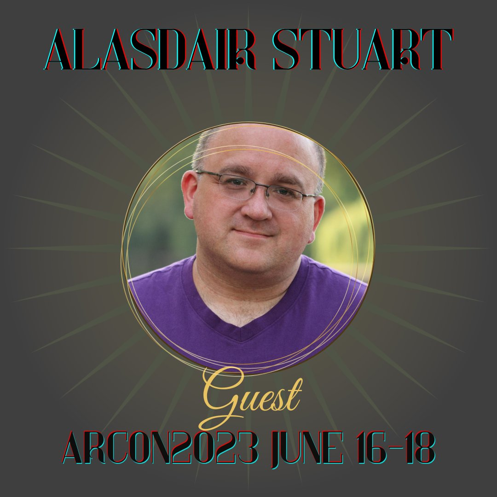
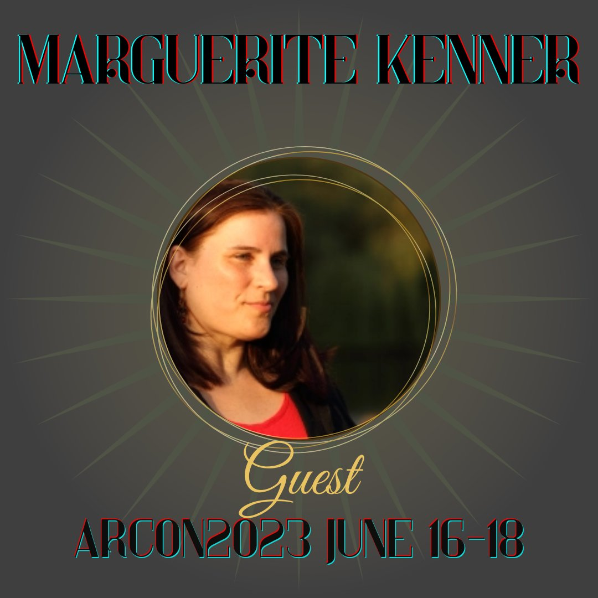
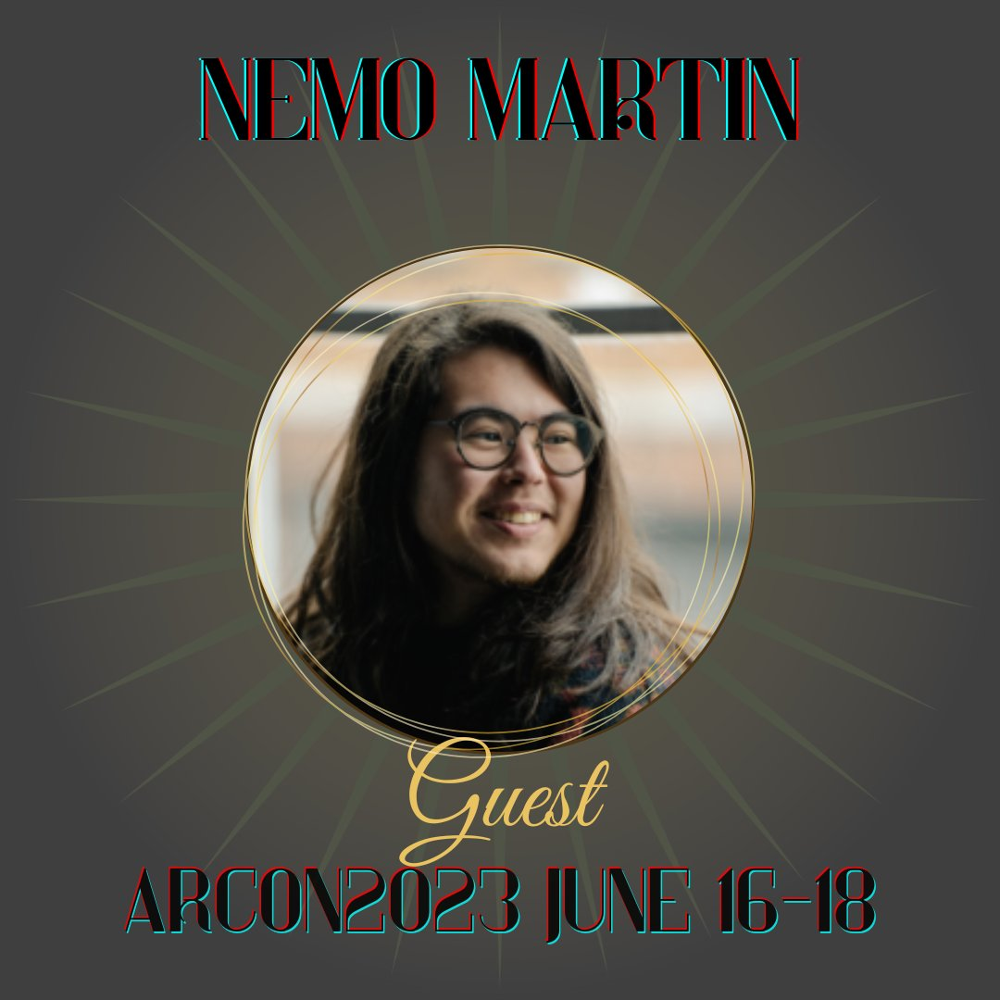
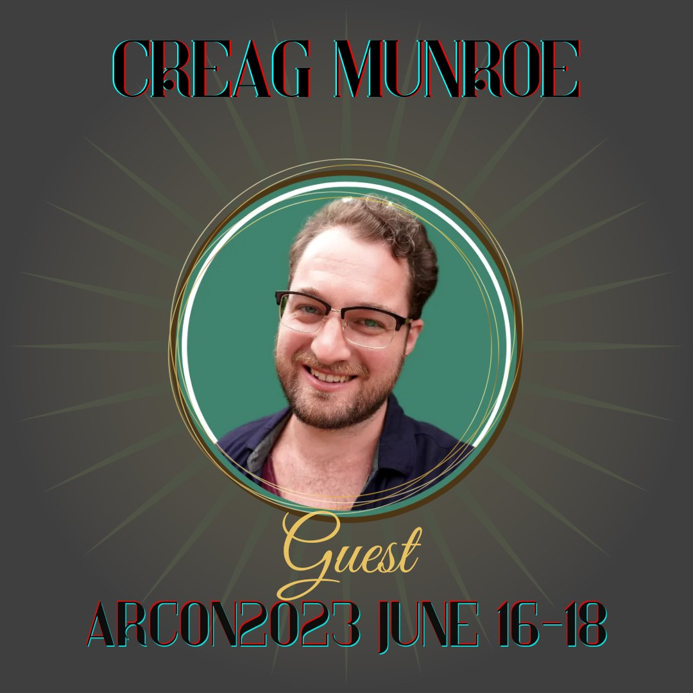
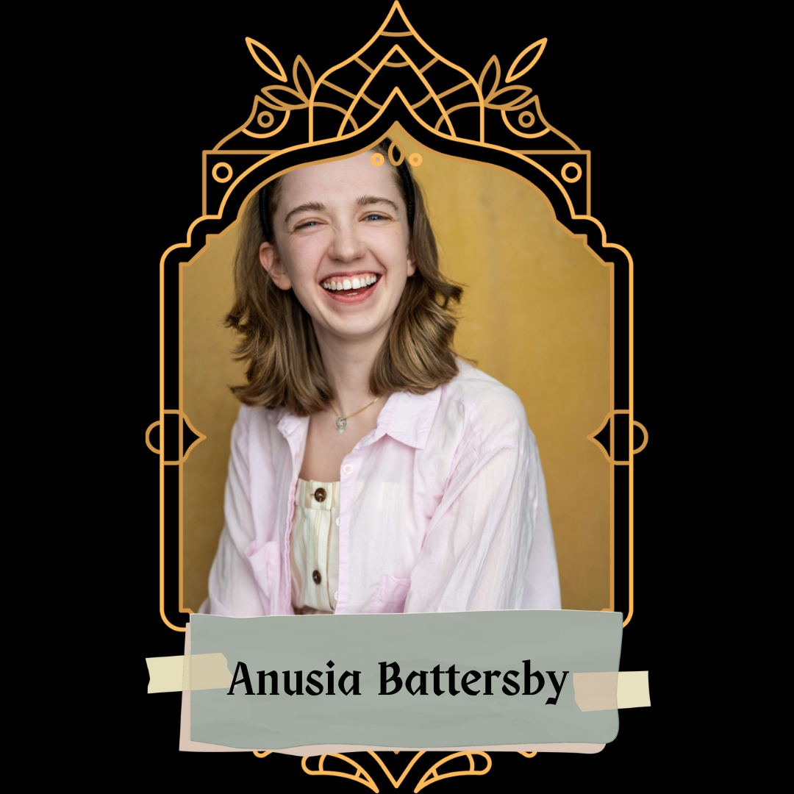
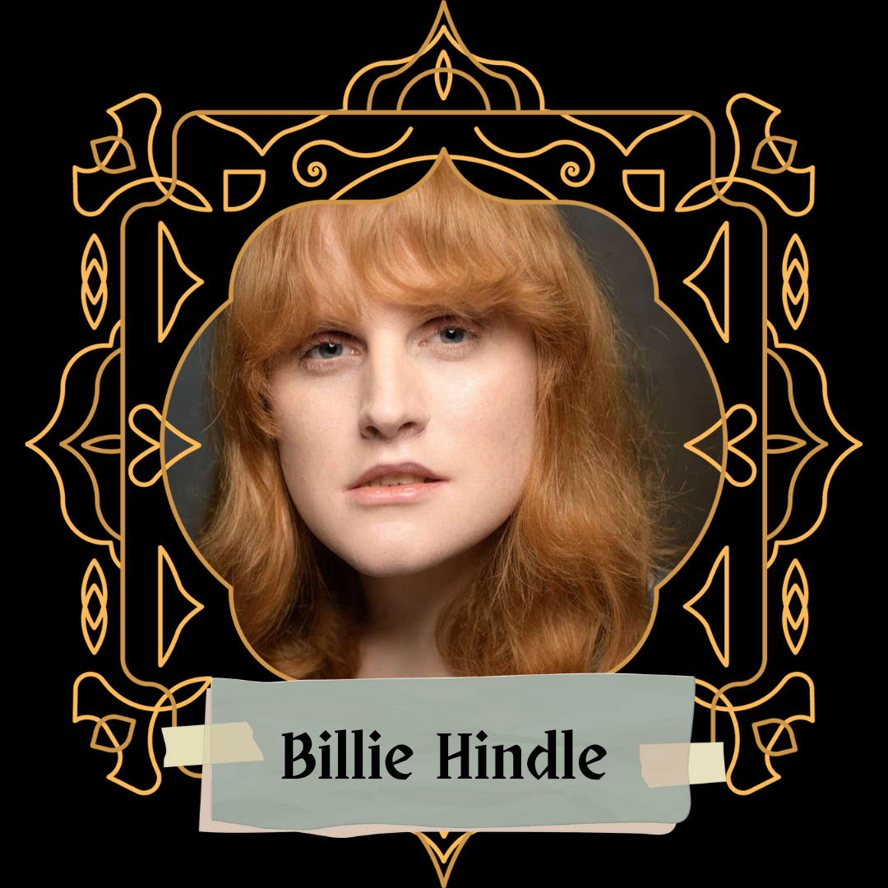

+++
title="Previous Years"
lastmod=2024-09-18T00:00:00+00:00
+++

Looking for inspiration for your next game, panel, or event, or just want to see what we're about? Peruse some of our previous events to see what kinds of things we love!

<!--more-->



* 
* 
* 
* 
* 
* 
{id="guests"}




### Cosplay Makeup Basics
Beginner-friendly, no-experience-needed tutorial for looking your best in your cosplay photos.
* Panelist: Hosta

### Beat Your Face (Like It Owes You Money): Easy Cosplay Wounds & Scars For The Non-Makeup-Artist
This panel will cover entry level, accessible methods for basic effects in bruising, light wounds, exhaustion/illness, good old extra eyeballs, and base contouring for cosplay photos.
* Panelist: Hosta
* Tags: Light gore

### The Last and Greatest Horror: Death, Jonah, and the Jamesian Tradition
In the canon of The Magnus Archives, death is a looming, ever present evil and the primary motivation behind Jonah’s machinations. While there are entities that briefly experience death and others who exist in death-like states, TMA doesn’t contain ghosts in the traditional sense. Despite taking inspiration from M.R. James’s ghost stories it paints a very different image of death, and this panel seeks to examine the ways the series draws from horror tradition to shape its greatest and final fear.
* Panelist: statuscrows
* Tags: Spoilers for the end of TMA; death and canon typical horror elements

### Why Are JMart So Blorbo?
A reflection on what Jon and Martin and their relationship mean to me, trying to get to the bottom of why they’ve lived rent free in my brain for over two years.
* Panelist: AsTheJayFlies
* Tags: Canon typical trauma; spoilers for the end of TMA

### Creative Commons Wisdom
You hear it after every episode of your favourite podcast, but do you know what all those words after 'a Creative Commons' means? And more importantly, what does it mean to you? Join indie podcasting's works-for-cookies lawyer, Marguerite Kenner, for an introduction to the Creative Commons licenses, their history and elements, and how fans and creators alike can benefit from their motto 'when we share, everyone wins'.
* Panelist: Marguerite Kenner

### “I really love JME,” or, What It Means To Ship A Rarepair In Fandom
Using the example of shipping Jon/Martin/Elias, this panel sought to explore what it feels like to love a rarepair in fandom, while acknowledging all the frustration and lonely feelings that can arise from it. It's also an enthusiastic manifesto for creating the content you would like to see for a ship you love, despite the apparent lack of an audience, and, perhaps, a subtle way to express how Jon/Martin/Elias is a very sexy ship, actually.
* Panelist: RavenXavier
* Tags: NSFW; spoilers for the end of TMA; creator chose not to use warnings
 
### A Fan Studies Primer for Fans
Fan studies is a field within academia that is constantly growing and expanding, but why should you, the fans, care about what a bunch of academics are saying? This panel provides a brief introduction to the state of the field and key theories, and it makes the argument that academic thought affects the real world, but especially in the case of fandom due to the close relationship between scholars and fans in the existence of the scholar-fan/fan-scholar/"aca-fan."
* Panelist: Ace J. (Phoebenavarro)
* Tags: Discussions of racism, sexism, homophobia, transphobia, and stigma surrounding mental health issues both in a fandom context and within academia

### Britpicking The Magnus Archives
Why is it significant that Elias Bouchard got a 3rd in PPE from Christ Church college? How is the UK school system structured (and how would it have been during the time when Jon would have attended)? Why will Jon never wake up to the sound of cardinals outside his window? Zalia, a real live British person, will cover some of the basics. Bring your Britpicking questions!
* Panelist: Zalia Chimera
* Tags: Spoilers for the end of TMA; possible political discussion and swearing

### The Themes and Dynamics of JonDaisy
This will be a panel centered around Jonathan Sims and Daisy Tonner. We'll explore the textual examples of their relationship within the podcast, how their dynamic evolved over time, and how this is relevant to the themes of TMA. Discussions of meta and fan-focused thoughts will follow.
* Panelist: Mx. Charming
* Tags: Spoilers for the end of TMA; discussions will broadly include mentions of: police brutality, abuse/violence, kidnapping, attempted murder, childhood endangerment/trauma

### Jonah and the Villain of A Thousand Faces
A panel discussion about Jonah Magnus. What do we really know about this integral villain to the series? How certain aspects of his character have pervaded through fandom despite having no basis in canon.
* Panelist: Freetobeproblematic
* Tags: NSFW; spoilers for the end of TMA; darker subject matter

### (Some of) The Real Forgotten Peoples that Inspired Trice Forgotten
Nemo Martin leads a tour of the real people whose histories were the impetus behind the creation of the characters of Trice Forgotten.
* Panelist: Nemo Martin
* Tags: Discussions of enslavement, nineteenth century racism, taxidermy / animal death (no graphic images), mentions of war and injury, mentions of non-consensual relationships.

### Make Your Statement: A TMA Oral History
Fandoms can be life-changing: they're community, they're creative support and inspiration, they're an expression of joy (and, sometimes, of personality conflicts). From its very early days in 2016 to the explosion of 2020 and the unexpected resurrection of The Magnus Protocol, TMA fandom has been one hell of a ride. Join us for a panel-style discussion of the history of the fandom from our own points of view, and for information on how you can contribute to an oral history of TMA fandom as a whole.
* Panelist: J. Quadrifrons | Flammen | Martyn
* Tags: NSFW; spoilers for the end of TMA; creator chose not to use warnings

### To Divide the Fungal Bloom from the Maggot: or, There's No Such Thing as a Fear Entity
Gerry tells us that there are a number of different ways of classifying the Fears, but his mother and the Magnus Institute preferred Smirke's fourteen. What other ways exist, and what does their implied existence (and the OIAR manual in TMP) suggest about how the Fears interact and how they spread throughout the multiverse?
* Panelist: J. Quadrifrons

### Fan Studies for Fans: Recent Developments
Fans aren’t the only ones arguing amongst themselves about issues in our communities, academics who study fans do it too. Tune in to hopefully gain some insight into how to navigate your own fandom experience through a discussion of recent works in fan studies.
* Panelist: Ace Phoebenavarro 

### A Civil Servant's take on the OIAR
Speculations that can be made about the OIAR (and the people working there) by comparing it to the civil service as a whole.
* Panelist: Ghostofnoodlewrap

### The Magnus Multiverse - Narrative uses and possibilities of alternate realities' tropes
This panel will be exploring the different tropes linked to parallel universes and/or alternate realities in general media, in order to reflect and speculate on what it might mean for Magnus Protocol, both in terms of worldbuilding and for its characters.
* Panelist: RavenXavier

### Nightmare Fabrication - How to make Mr. Bonzo's head
This panel will show you step by step how to bring a piece of hell to your home by creating Bonzo's head as a costume piece.
* Panelist: Bloody Baroness Cosplay
* Tags: Gore, eyes, Mr. Bonzo

### Fear and Arousal: Kink and BDSM Applications of the Fears
A discussion of the Fears from The Magnus Archives as they pertain to the exploration of kink and BDSM. Get inspired, and take those ideas to do or create some delightfully nasty things with them!
* Panelist: Leto
* Tags: NSFW; Discussion but not lengthy description of a wide range of BDSM activities, some of which are controversial, harmful, illegal, or physically impossible.

### Audio Editing 101
A quick beginner crash course for those looking to get into audio editing! I will show how to edit a scene from recording to the finished product.
* Panelist: Henry J. / @Gen_hen

### Magnus Opus: Alchemy in the Magnus Protocol
Part proto-chemistry, part occult mysticism, alchemy built on the philosophy of Aristotle and enchanted the likes of Isaac Newton. A review of the history of alchemy and its involvement in the Magnus Protocol.
* Panelist: tacky_tramp



### Out-of-Context Magnus Archives Quote Quiz
This is a trivia game where players will be presented with quotes from The Magnus Archives and asked to guess which character said it or what statement it is from. People who come to the panel will be able to play by joining the quiz using an internet-connected device.
* Panelist: Wasp | Audience Participation
* Tags: Canon-typical everything

### Magnus Against Humanity
Join a custom Magnus-themed online game of Cards Against Humanity! You may drop in and out at any point, with the caveat that technical reasons permit only a limited amount of players at a time. We will try to rotate players to give a chance to everyone who wants to join. Chat (voice or text) not mandatory!
* Panelist: Aza/sazandorable | Audience Participation
* Tags: NSFW; spoilers for the end of TMA; game-runner has no way to foresee the content but expect raunchiness, unwholesome ships, horror, and general NSFW and dark humour

### Quick Cosplay Game
Do you have the urge to cosplay, but only in the worst, cheapest, and best way possible? This game's for you! Join us as we try and cosplay randomly selected characters from TMA, with only thirty minutes to do so!
* Panelist: Emperio | Audience Participation

### Audio Drama Jeopardy
Have you been listening to approximately 10^25 hours of podcasts since quarantine and now know a ton of trivia and fandom lore? If so, this game is for you! It will be focused on Night Vale and The Magnus Archives, but there will also be questions about lesser known podcasts.
* Panelist: Ocean | Audience Participation
* Tags: Spoilers for the end of TMA; may include discussion of violent acts

### Lightning Fanfiction
Come and write some speedy fanfiction! Prompts will be provided of character(s), setting, and theme before everyone will have twenty minutes to write a fast fanfiction. Silly, sexy, or scary, all genres will be welcome!
* Panelist: Freetobeproblematic | Audience Participation
* Tags: NSFW; spoilers for the end of TMA; no limits on the type of fanfiction will be given, but we will ask that people who are inspired to write darker fanfiction will provide trigger warnings before sharing so others can mute the audio.

### Speed Drawing
Let’s draw - terribly! Participants will be given characters and prompts to draw through multiple rounds, with the timer getting faster and faster each time. Don’t worry about quality here, speed’s the name of the game!
* Panelist: Carrie

### Bucket of Doom
A party game based on perilous situations and blagging your way out of them.
* Panelist: Ghostofnoodlewrap
* Tags: NSFW; Creator chose not to use warnings

### For the Archivist
“For the Archivist” puts a Magnus Archives spin on the storytelling game “For the Queen.” Participants will work together to weave a tale about the Archivist’s complicated relationships with their Institute colleagues, and a perilous journey to uncover hidden truths.
* Panelist: tacky_tramp

